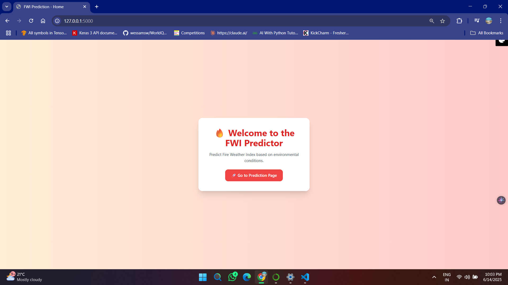
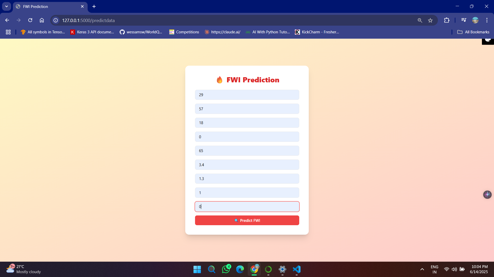
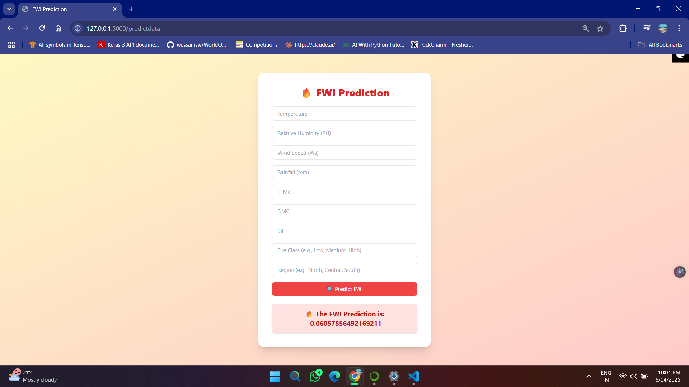

# 🔥 Forest Fire Prediction - End-to-End ML Project

This project aims to **predict the Forest Fire Weather Index (FWI)** using machine learning models, trained on real-world data sourced from Algeria’s government datasets. The model uses environmental features to provide accurate FWI predictions to help mitigate wildfire risks.

---

## 📊 Project Overview

- **Problem**: Predicting Fire Weather Index (FWI) based on environmental and meteorological features.
- **Dataset Source**: Algerian government open data on forest fires.
- **Objective**: Build an end-to-end ML pipeline from data preprocessing to deployment using Flask and AWS.

---

## 🧹 Data Collection & Preprocessing

- **Source**: Official Algerian Government Fire Records
- **EDA**: Conducted exploratory data analysis using statistical methods, correlation, and covariance.
- **Challenges**:
  - Unbalanced and incomplete data
  - Presence of categorical values and missing entries
- **Solutions**:
  - Preprocessing included:
    - Handling missing values
    - Feature selection using correlation & covariance
    - Encoding categorical variables using OneHotEncoder
    - Feature scaling using `StandardScaler`
  - Converted categorical features to machine-understandable numerical formats

---

## 🧠 Machine Learning Modeling

### Algorithms Used:
- **Linear Regression**
- **Regularized Models**:
  - Ridge Regression (L2)
  - Lasso Regression (L1)
  - ElasticNet
  - RidgeCV / LassoCV / ElasticNetCV for cross-validated tuning

### Techniques:
- Hyperparameter Tuning
- Cross-Validation
- Performance Evaluation (MAE, RMSE, R²)

### Results:
- Achieved a prediction accuracy of **98%**
- Best performing model: **Ridge Regression (L2) with Cross-Validation**

---

## 🚀 Deployment

- **Framework**: Flask (Python Web Framework)
- **Interface**: Created a user-friendly web form for prediction
- **Server**: WSGI (Web Server Gateway Interface)
- **Deployment Pipeline**:
  - Code pushed to **GitHub**
  - Integrated with **AWS Elastic Beanstalk** for automated CI/CD
  - Environment and pipeline setup between **GitHub and AWS**

---

## 📸 Screenshots

### Home Page

### Prediction Form

### Result Display

---
---

## 📁 Project Structure

FOREST_FIRE_PREDICTION_ML_END_TO_END_PROJECT/
│
├── dataset/ # Contains raw and cleaned data files
├── models/ # Saved ML models (pickle or joblib format)
├── notebooks/ # Jupyter notebooks for EDA and experimentation
├── templates/ # HTML templates for Flask web app
│ ├── home.html
│ └── predict.html
│
├── app.py # Main Flask application file
├── requirements.txt # Python dependencies
├── README.md # Project overview and documentation
└── .vscode/ # Editor configuration (optional)

